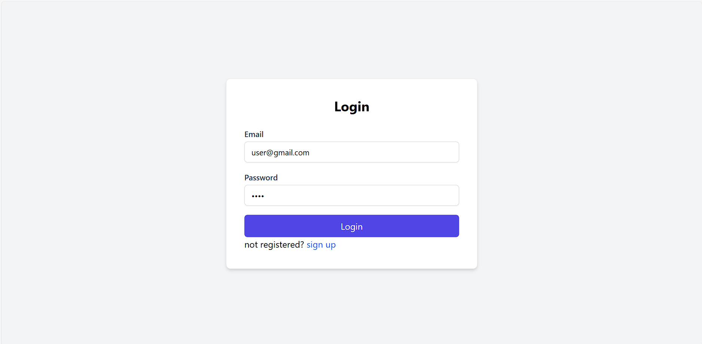
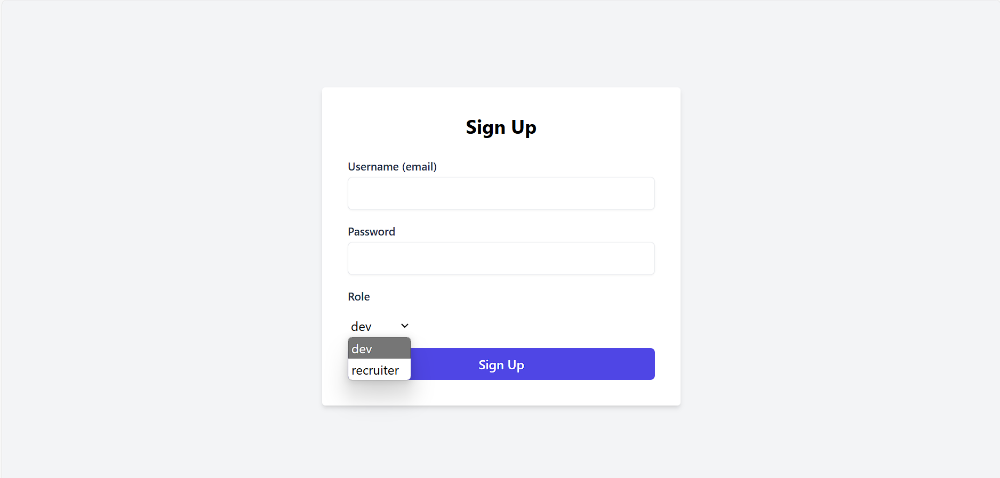
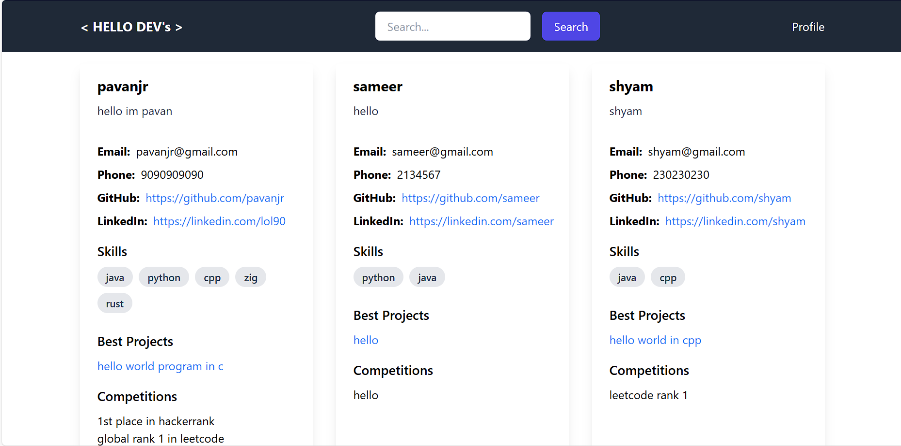
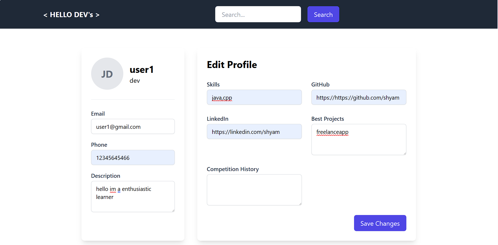
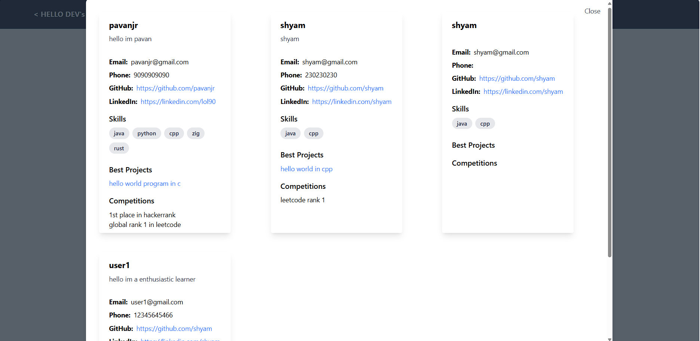
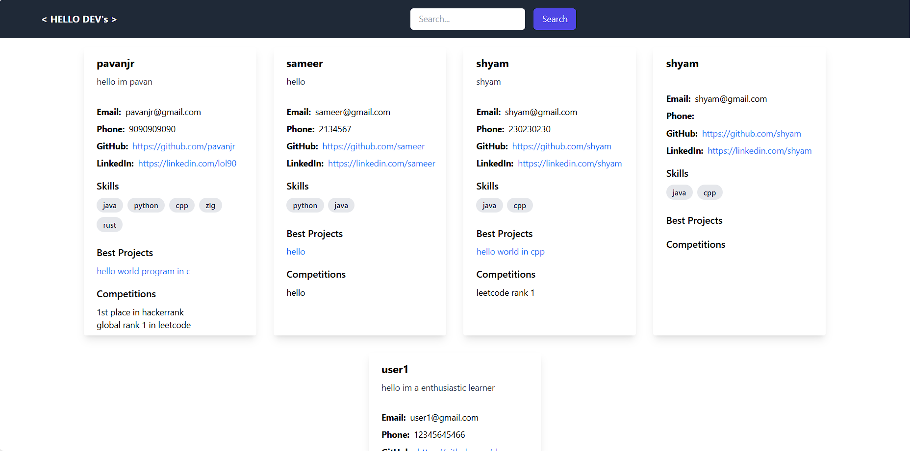

##
This is a MERN stack app 
this project focus on basics of mongodb nodejs and react 
Note: this project uses only three react hooks "useState" & "useEffect" & "usenavigate"
(NO AUTHENTICATION)
for styling tailwind css is used 
This is a freelance recruiter and developer showcase app 
where a recruiter can see all the profiles of the developer
 who are signed in and developers can edit their profile according to their projects 
Note while running the app change MOGODB_URI 
login page:

signup page:

Developers page:

Developers Profile:

Search:

Recruiters Page: 

